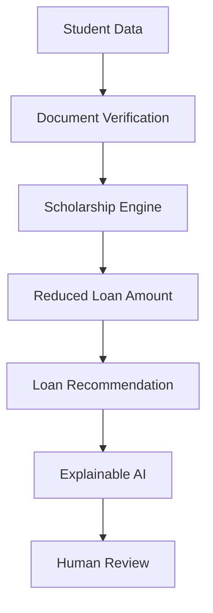

# Project Context

## 1. Background

Education financing in India (and similar markets) typically involves two disconnected processes: applying for scholarships, and applying for education loans. Students rarely see how the two interact — a scholarship award should reduce the loan a student actually needs, but in practice these are evaluated by different institutions on different timelines with no shared, transparent logic.

## 2. Problem

Students struggle to understand:

- **Why loans are rejected** — decisions from banks are often communicated with minimal reasoning.
- **Which scholarships they qualify for** — eligibility criteria are scattered and inconsistently applied.
- **How scholarships reduce loan burden** — no tool connects the two calculations end-to-end.

This opacity has real consequences: students over-apply for loans they don't need, under-apply for scholarships they'd qualify for, and lose trust in both processes.

## 3. Why Existing Approaches Fall Short

Most loan-eligibility tools are single-purpose credit calculators — they take financial inputs and return a binary result with no reasoning, and they don't account for scholarship support at all. Scholarship portals, in turn, rarely connect to the loan process. Neither gives the student a unified, explainable picture.

## 4. Solution

FairExplain AI treats scholarship calculation as a **precursor** to loan assessment, not a separate process, and wraps both in an explainability layer.

## 5. Guiding Principle

> **The AI recommends. The human decides.**

At no point does FairExplain AI issue a final, binding approval or rejection. Every output is explicitly labeled as a recommendation pending review by an authorized human at the relevant institution (university, bank, or scholarship provider). This is a hard constraint enforced at the prompt level (see [PROMPTS.md](./PROMPTS.md)) and at the UI level, not a stylistic choice.

## 6. Stakeholder Value

| Stakeholder | Value delivered |
|---|---|
| Students | A single, explainable view of scholarship + loan outcome before committing to either process. |
| Universities | Consistent, auditable scholarship screening criteria. |
| Banks | Pre-screened, explained applications that speed up manual underwriting. |
| Scholarship Providers | Transparent, reproducible eligibility criteria they can defend and refine. |
