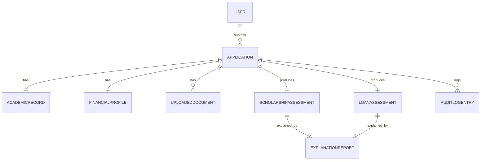

# Data Model

## 1. Entity Overview

| Entity | Purpose |
|---|---|
| **User** | An account holder — student, university reviewer, bank reviewer, or scholarship-provider reviewer. |
| **Application** | A single student's end-to-end scholarship + loan application. |
| **AcademicRecord** | Academic inputs for one Application. |
| **FinancialProfile** | Financial inputs for one Application. |
| **UploadedDocument** | A document uploaded in support of an Application, plus its OCR result. |
| **ScholarshipAssessment** | Output of the Scholarship Rule Engine for an Application. |
| **LoanAssessment** | Output of the Loan Rule Engine for an Application. |
| **ExplanationReport** | LLM-generated explanation + fairness note tied to an assessment. |
| **AuditLogEntry** | Immutable record of a scoring or explanation event (added per SRS NFR-4). |

## 2. Relationships

- `User 1:N Application` — a student may submit multiple applications over time (e.g., different academic years).
- `Application 1:1 AcademicRecord`
- `Application 1:1 FinancialProfile`
- `Application 1:N UploadedDocument`
- `Application 1:1 ScholarshipAssessment`
- `Application 1:1 LoanAssessment`
- `Assessment 1:1 ExplanationReport` (one explanation per assessment)
- `Application 1:N AuditLogEntry`

## 3. Schema Detail

### 3.1 User
| Field | Type | Notes |
|---|---|---|
| id | UUID (PK) | |
| role | Enum | student / university / bank / scholarship_provider / admin |
| name | String | |
| email | String | Unique |
| created_at | Timestamp | |

### 3.2 Application
| Field | Type | Notes |
|---|---|---|
| id | UUID (PK) | |
| user_id | UUID (FK → User) | |
| status | Enum | draft / submitted / needs_review / ready_for_report / closed |
| created_at | Timestamp | |
| updated_at | Timestamp | |

### 3.3 AcademicRecord
| Field | Type | Notes |
|---|---|---|
| id | UUID (PK) | |
| application_id | UUID (FK, unique) | |
| cgpa | Decimal | 0–10 |
| tenth_percent | Decimal | 0–100 |
| twelfth_percent | Decimal | 0–100 |
| backlogs | Integer | Active/unresolved count |

### 3.4 FinancialProfile
| Field | Type | Notes |
|---|---|---|
| id | UUID (PK) | |
| application_id | UUID (FK, unique) | |
| household_income | Decimal | INR/year |
| existing_emi | Decimal | INR/month |
| tuition_fee | Decimal | INR/year |
| requested_loan | Decimal | INR |

### 3.5 UploadedDocument
| Field | Type | Notes |
|---|---|---|
| id | UUID (PK) | |
| application_id | UUID (FK) | |
| doc_type | Enum | marksheet / income_proof / id_proof |
| file_url | String | Storage reference |
| ocr_extracted_data | JSON | Field-level extraction result |
| mismatch_flag | Boolean | True if OCR value conflicts with self-reported value |
| uploaded_at | Timestamp | |

### 3.6 ScholarshipAssessment
| Field | Type | Notes |
|---|---|---|
| id | UUID (PK) | |
| application_id | UUID (FK, unique) | |
| scholarship_percent | Decimal | See [RULE_ENGINE.md](./RULE_ENGINE.md) |
| scholarship_amount | Decimal | scholarship_percent × tuition_fee |
| outcome | Enum | Eligible / Needs Review / Not Recommended |
| rule_engine_version | String | For reproducibility/audit |
| computed_at | Timestamp | |

### 3.7 LoanAssessment
| Field | Type | Notes |
|---|---|---|
| id | UUID (PK) | |
| application_id | UUID (FK, unique) | |
| reduced_loan_amount | Decimal | requested_loan − scholarship_amount |
| outcome | Enum | Eligible / Needs Review / Not Recommended |
| confidence | Decimal | 0–100% |
| rule_engine_version | String | |
| computed_at | Timestamp | |

### 3.8 ExplanationReport
| Field | Type | Notes |
|---|---|---|
| id | UUID (PK) | |
| assessment_type | Enum | scholarship / loan |
| assessment_id | UUID | FK to ScholarshipAssessment or LoanAssessment |
| recommendation_text | Text | |
| reasons | Text[] | |
| confidence_note | Text | |
| fairness_note | Text | Result of Fairness Checker pass |
| llm_prompt_version | String | For reproducibility/audit |
| generated_at | Timestamp | |

### 3.9 AuditLogEntry
| Field | Type | Notes |
|---|---|---|
| id | UUID (PK) | |
| application_id | UUID (FK) | |
| event_type | Enum | score_computed / explanation_generated / fairness_flag / human_review_action |
| detail | JSON | Event-specific payload |
| created_at | Timestamp | |

## 4. Notes on Sensitive Data

`FinancialProfile` and `UploadedDocument` contain personally identifiable and financial data and must be encrypted at rest (see [ARCHITECTURE.md](./ARCHITECTURE.md) §7). No field in this schema stores caste, religion, or similar protected attributes — the Fairness Checker instead audits for indirect proxies (e.g., pincode-based inference), as described in [RULE_ENGINE.md](./RULE_ENGINE.md) §5.
