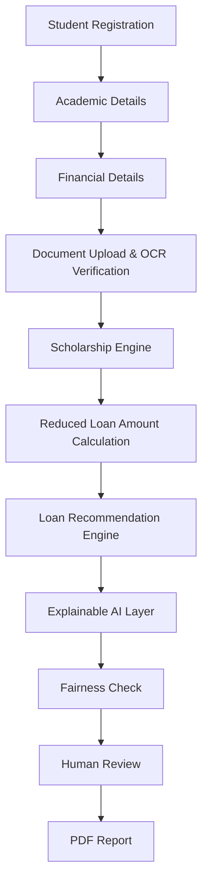

# FairExplain AI

**An Explainable AI platform for student financing — scholarship-aware loan recommendations, with a human always in the loop.**

---

## 1. Overview

FairExplain AI helps students understand two things that are usually opaque: *which scholarships they qualify for*, and *how much loan they actually need once that scholarship is applied*. Rather than treating loan eligibility as a single black-box decision, the system deliberately separates scholarship scoring from loan assessment, then explains every recommendation in plain English before a human makes the final call.

The platform evaluates:

1. **Scholarship eligibility** — based on academic performance, financial need, and academic conduct (backlogs).
2. **Remaining loan requirement** — the loan amount actually needed after scholarship support is applied.
3. **AI-assisted loan recommendation** — a *recommendation only*, never a final approval or rejection.

### Responsible AI principles

- **Transparent scoring** — every score is traceable to a documented formula, not a hidden model.
- **Explainable recommendations** — every output ships with a plain-English reason and a confidence level.
- **Fairness checks** — outputs are screened for reliance on sensitive or proxy attributes.
- **Human-in-the-loop** — the system recommends; a qualified human (university/bank officer) decides.

## 2. System Workflow



## 3. Tech Stack

| Layer | Technology |
|---|---|
| Frontend | React + Vite + TypeScript, Tailwind CSS, shadcn/ui, React Hook Form, TanStack Query, Recharts |
| Backend | FastAPI, SQLAlchemy, PostgreSQL (Neon) |
| AI Layer | OCR extraction, deterministic Rule Engine, LLM Explanation (Gemini/OpenAI), Fairness Checker |
| Deployment | Vercel (frontend), Railway (backend) |

## 4. Folder Structure

```
fairexplain-ai/
├── frontend/       # React + Vite client
├── backend/        # FastAPI services
├── docs/           # Project documentation (this set)
├── dataset/        # Sample/synthetic academic & financial data
└── prompts/        # Versioned LLM prompt templates
```

## 5. Documentation Index

| Document | Purpose |
|---|---|
| [PRD.md](./PRD.md) | Product vision, users, features, success metrics |
| [SRS.md](./SRS.md) | Functional & non-functional requirements |
| [CONTEXT.md](./CONTEXT.md) | Problem statement and solution rationale |
| [ARCHITECTURE.md](./ARCHITECTURE.md) | System architecture and service breakdown |
| [DATA_MODEL.md](./DATA_MODEL.md) | Entities, schema, and relationships |
| [RULE_ENGINE.md](./RULE_ENGINE.md) | Scholarship & loan scoring logic |
| [PROMPTS.md](./PROMPTS.md) | LLM prompt design and output contract |
| [ROADMAP.md](./ROADMAP.md) | Phased development plan |

## 6. Project Status

Currently in active development. See [ROADMAP.md](./ROADMAP.md) for phase-by-phase status.

## 7. Disclaimer

FairExplain AI produces **recommendations, not financial decisions**. All scholarship and loan outcomes are subject to review and final approval by an authorized human reviewer at the relevant institution.
